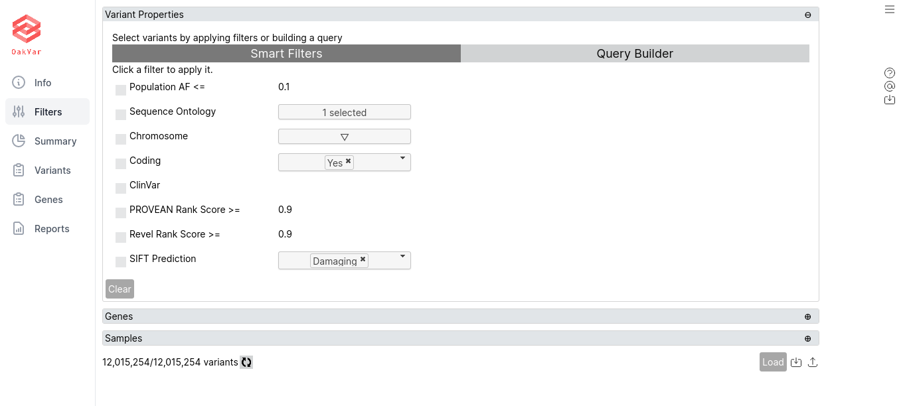
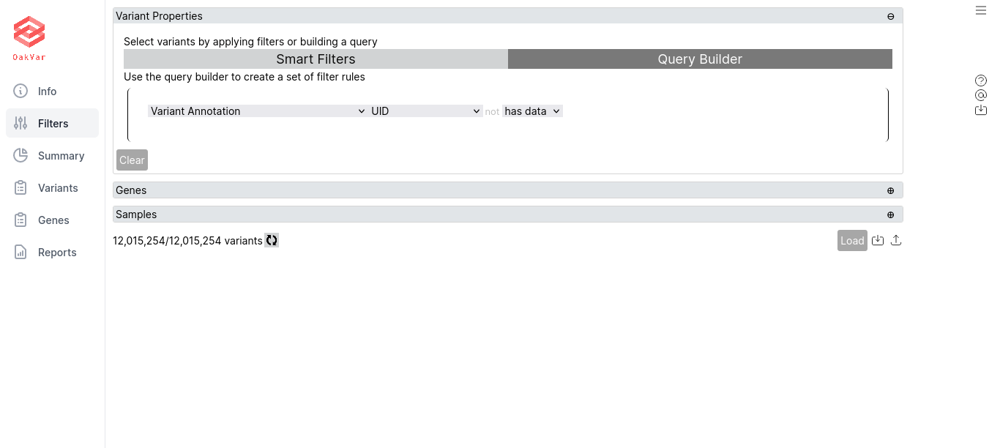
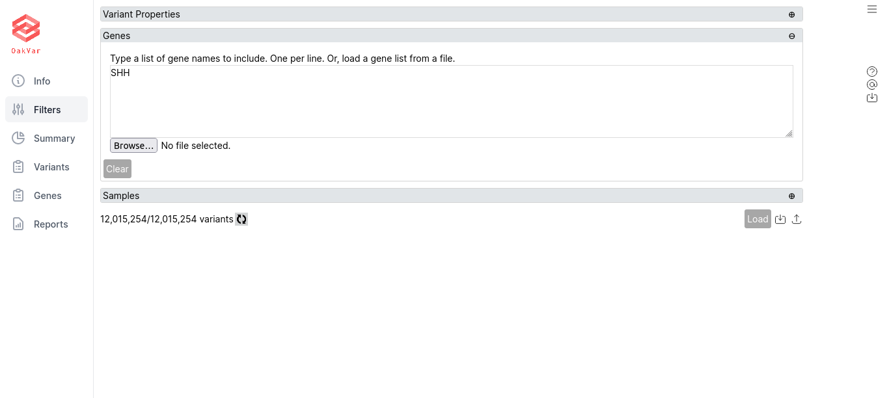
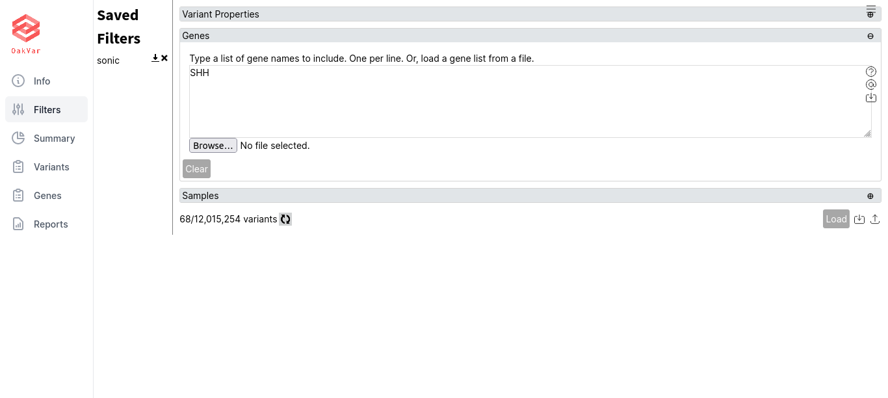

Filtering Variants
==================

Filters in OakVar allow to select those variants which are relevant. As the number of variants in a genome usually is very large, you need to filter them first. OakVar cannot load more than 100,000 variants at once.

Filter tab
----------

Select the **Filter** page in the Result Viewer. There are sections where you can filter the variants:

• *Variant Properties*, with **Smart Filters** and **Query Builder** tabs 

• *Genes*, where you can type in any particular gene names

• *Samples*, which is used mainly for oncological purposes and is not used in Just-DNA-Seq.

Using Smart Filters
-------------------

Here are various useful filters:

**Population AF «==*** allows to set the maximum allele frequency in population.

**Sequence Ontology** allows to choose one or more sequence ontologies.

**Chromosome** allows to choose one or more chromosomes *or their specific versions.* E.g. chr1, chr10 and so on.

**Coding** allows to include only coding or noncoding variants.

**ClinGen**

**ClinVar** allows to include only variants with data from ClinVar.

**dbSNP Common ID**

**PROVEAN Rank Score >=** includes variants with PROVEAN rank score not less than 0.9

**Revel Rank Score >=** includes variants with Revel rank score not less than 0.9

**SIFT Prediction** can be set as Damaging or Tolerated.

Using Query Builder
-------------------

Here you can create a set of filter rules.

By default, an opening (left) parenthesis appears with buttons **+** and **(** in the lower left corner, and a greyed out switch **NOT** appears if you hover the mouse in the upper left corner, which allows to make the following rule negative by clicking on it. Clicking **NOT** once again deactivates it.

Click **+** to add a rule. A line of boxes will appear:

The first drop-down box is the source to which the rule will apply. For example: Variant Annotation, ClinVar, PharmGKB etc.
The second drop-down box allow to select an item in the source to apply the rule. E.g. UID, Chrom, Position, Gene etc.
The following switch "not", greyed out (inactive) by default, allows to select if the following condition should apply or should not apply. For the latter, click the word "not", and it will become black (active). To remove "not" from the condition, just click it again, and it will be greyed out.
The next drop-down allows to select the condition from one of the following:
**has data** - if the item being searched contains any data
**equals** - opens one more box where you can enter what the item should be equal to
**is empty** - if the item being searched is empty
**in range** - opens two boxes where you enter the boundaries of the range where the item should be
**<=** - if the item is less or equal to the value in the following box
**>=** - if the item is greater or equal to the value in the following box
At the end of the line, a small "x" allows to delete the whole rule by clicking on it.

If you click **+** once again, another rule is added, and between them the operator **and** is displayed by default, meaning that to satisfy the filter, both rules should apply. You can change it to **or** by clicking on it, so that to satisfy the filter, one of rules being true may be enough. Clicking **or** once again turns it to **and** again.

You can add as many rules as you wish, and the operators **and** / **or** between them will follow the general priority logic of boolean operations, i.e. **and** has the priority over **or**, as in any program code.

To change the priority and build more complex logical rules, you can click **(** which makes a separate set of rules (in parentheses), which have higher priority, as in mathematical operations. Note than the **and** / **or** operator which appears before the parentheses depends of the previous operator selected, i.e. if it was **or**, the next one will also be **or**, and vice versa. You can always change the operators by clicking on them.

Within the parentheses, you can create any number of rules, and there are separate **+** and **(** buttons to add new rules and nested parentheses inside the parentheses. Also in the upper left corner a separate **NOT** switch appears if you hover the mouse over it.

You can also move any rule to another rule. To do this, drag an anchor **||** which appears from the left side of the rule if you hover the mouse there, and drop it on any rounded **+** anchors which appear between rules and/or parentheses (not on the **+** button that adds rules).

**BUG NOTE: If dropping a rule just before or after itself, it redirects browser to an error page. In this case all the previously made filter settings may not be saved. Please avoid dropping a rule before or after itself until this bug is fixed in Oakvar.**

Filtering by Genes
------------------

Switch to **Genes** section and enter any particular gene names, one per line. Also you can load them from a file by clicking **Browse...**

Clearing Filters
----------------

Under any section you can click the **Clear** button to remove any filter settings from that section.

Saving and Importing Filters
----------------------------

You can save the filter (the whole set of rules) in OakVar for further loading, as well as exporting to a file, or import it from a file.

To save the filter, click the middle button ("inward arrow") in the lower right corner of the page, and enter the filter name.

**NOTE:** Filters are saved internally in OakVar, i.e. on the server if using a remote installation. To have a filter saved into a local file, export it after saving.

The saved filter appears in the left part of the page in the **Saved Filters** list:

To load a saved filter, just click its name.
To export a saved filter into a file, click the icon with a down arrow next to its name.
To delete a saved filter, click the X icon in its line.

To import a filter from a file, click the "up arrow" (rightmost) button in the lower right corner of the page, and browse for a file to import (e.g. pathogenic.json). Clicking **Open** in the browse window loads the filter. **NOTE:** the filter is not saved automatically, you need to save it with "Save filter" (inward arrow) button if you want to save in on the server for further working.

Loading Filtered Variants
-------------------------

When building a filter, you can click the refresh button next to the number of variants (e.g. **68/12,015,254 variants**) in the lower left corner of the page to check how many results the filter provides. If the number is small enough, when the filter is ready, click **Load** in the lower right corner of the page. After loading the filter, the number of variants in the lower left corner (the first number before the slash, while the second one is the total number of variants and is not changed) may be updated.

When the filtered variants are loaded, you can proceed to the **Variant** tab to analyse them (see the next section).
