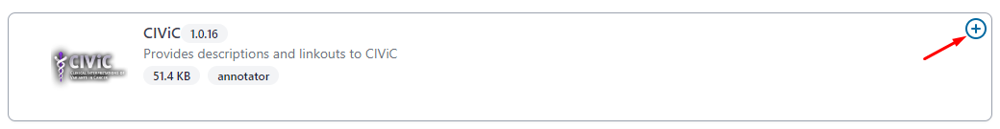

Developer guide
===============

**NOTE:** *Both OpenCravat and OakVar can be used to annotate a human genome. At the beginning of the project we used OpenCravat as a framework. However, as OakVar is based on OpenCravat and contains more advanced features customized specially for personal longevity genomics, we decided to base further development of the project on OakVar.*

Installing OakVar
----------------------------

Since our module is based on OakVar, you have to install OakVar first to run our module, if it is not already installed. 
OakVar docs: https://oakvar.readthedocs.io/en/latest/

Pre-requirements for Oakvar: 
  - installed conda/mamba environment management systems, or you can use their lighter versions: miniconda/micromamba
  - installed python and pip

You can find documentation for mamba here: https://mamba.readthedocs.io/en/latest/index.html

And for conda here: https://docs.conda.io/en/latest/

*The installation of OakVar and the further work should proceed after activation of an environment created by Conda/Mamba or Miniconda/Micromamba.*

Installing Annotators
----------------------

For the Longevity module to work, you need to install the following annotators:

1.	clinvar

2.	dbsnp

3.	gnomad

4.	ncbigene

5.	omim

6.	pubmed

You can install them by using terminal or Oakvar GUI.

**Installation using terminal:**

Use the following command:

``ov module install module_name``

**Installation using GUI:**

To activate Oakvar GUI, use the following command:

``ov gui``  or ``ov gui --multiuser --debug`` to open GUI in multiuser debug version.

After the execution GUI will be opened in your browser.

Go to “Store” and find the annotators and install them:

Installing Postaggregators
----------------------

For the Longevity module to work, you need to install the following postaggregators:

1.	just_prs

2.	just_longevitymap

3.	just_drugs

4.	just_cancer

5.	just_coronary

You can install them by using terminal or Oakvar GUI.

**Installation using terminal:**

Use the following command:

``ov module install module_name``

**Installation using GUI:**

To activate Oakvar GUI, use the following command:

``ov gui``  or ``ov gui --multiuser --debug`` to open GUI in multiuser debug version.

to open GUI in multiuser debug version

After the execution GUI will be opened in your browser.

Go to “Store” and find the annotators and install them:

Installing the Reporter
--------------------

**Installation using terminal:**

Use the following command in terminal:

``ov module install longevity2reporter``

**Installation using GUI:**

To activate Oakvar GUI, use the following command:

``ov gui``  or ``ov gui --multiuser --debug`` to open GUI in multiuser debug version.

to open GUI in multiuser debug version

After the execution GUI will be opened in your browser.

Go to “Store” and find the annotators and install them:

All further work also can be done by using command-line interface, for more information check OakVar documentation: https://rkimoakbioinformatics.github.io/oakvar/cli/

Or by using GUI: https://just-dna-seq.readthedocs.io/en/oakvar/getting_started.html

  
The description of some modules
---------------------------------------------
  
All annotators can be divided into 2 groups:

1) Tools that predict pathogenicity (**bold**)
2) Tools that provide information like databases

Here are their internal (coded) module names:

• **cadd_exome** (1.6.1) - CADD is a tool for scoring the deleteriousness of single nucleotide variants as well as insertion/deletions variants in the human genome

• gnomad_gene (2.2.1) - gene level population statistics from gnomAD

• pubmed (1.1.5) - articles related to a particular gene

• **clingen** (1.0.1) - NIH-funded resource that defines the clinical relevance of genes and variants

• **clinpred** (1.0.0) - prediction tool to identify disease-relevant nonsynonymous single nucleotide variants

• clinvar (2021.10.01) - ClinVar is an archive of reports of the relationships among human variations and phenotypes, as well as interpretations of clinically relevant variants (Uncertain significance, Likely pathogenic, Pathogenic etc.)

• mitomap (1.1.0) - a human mitochondrial genome database

• ncbigene (2019.08.02) - gene descriptions from NCBI (National Center for Biotechnology Information) Gene database

• omim (1.0.0) - catalog of human genes and genetic disorders and traits

• **prec** (3.6.0) - provides a database identifying rare and likely deleterious loss-of-function (LoF) alleles

• **provean** (1.0.0) - tool which predicts whether an amino acid substitution or indel has an impact on the biological function of a protein

• **revel** (2020.12.02) - ensemble method for predicting the pathogenicity of missense variants based on a combination of scores from 13 individual tools

• **sift** (1.2.0) - predicts whether an amino acid substitution affects protein function based on sequence homology and the physical properties of amino acids

• GnomADD - aggregating and harmonizing both exome and genome sequencing data from a wide variety of large-scale sequencing projects

• PharmGKB - an NIH-funded resource that provides information about how human genetic variation affects response to medications

• dbSNP - the Single Nucleotide Polymorphism Database is a free public archive for genetic variation within and across different species developed and hosted by the National Center for Biotechnology Information (NCBI) in collaboration with the National Human Genome Research Institute (NHGRI)
