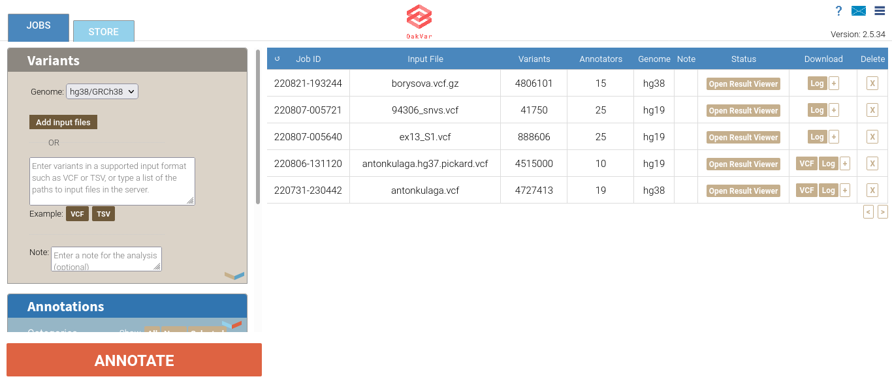

Getting Started
===============

Choosing Framework: OakVar vs OpenCravat
----------------------------------------

Both OpenCravat and OakVar can be used to annotate a human genome. However, as OakVar is based on OpenCravat and contains more advanced features customized specially for personal longevity genomics, it is recommended to use OakVar, and this documentation is based on it.

* **NOTE:** *An older OpenCravat-based version of documentation (in progress) could be found here: https://just-dna-seq.readthedocs.io/en/master/*

Installing OakVar
----------------------------

Our module is based on OakVar. You have to install OakVar first to run our module. 
OakVar docs: https://oakvar.readthedocs.io/en/latest/

Pre requirements for Oakvar: 
  - installed conda/mamba environment management systems, or you can use their lighter versions: miniconda/micromamba
  - installed python and pip

You can find documentation for mamba here: https://mamba.readthedocs.io/en/latest/index.html

And for conda here: https://docs.conda.io/en/latest/

**The installation of OakVar and further work must proceed after activation of an environment created by Conda/Mamba or Miniconda/Micromamba.**

Installing Annotators
----------------------

For Longevity module to work you need to install the following annotators:
1.	clinvar
2.	dbsnp
3.	gnomad
4.	ncbigene
5.	omim
6.	pubmed
7.	longevitymap

You can install them by using terminal or Oakvar GUI

**Installation using terminal:**

Use the following command:

``ov module install module_name``

**Installation using GUI:**

To activate Oakvar GUI use the following command:

``ov gui``

After the execution GUI will be opened in your browser.

Go to “Store”:

.. image:: gui-installation1.png
  :alt: gui-installation store

Find annotators and install them:

.. image:: gui-installation2.png
  :alt: gui-installation annotators

Installing reporter
--------------------

**Installation using terminal:**

Use the followin command in terminal:

``ov module install longevity-combinedreporter``

**Installation using GUI:**

To activate Oakvar GUI use the following command:

``ov gui``

Go to “Store”:

.. image:: gui-installation1.png
  :alt: gui-installation store

Find the reporter called “longevity-combinedreporter” and install it:

.. image:: gui-installation3.png
  :alt: gui-installation reporter

Loading Genome Files
---------------------

1. Open OakVar in your browser. You will see the index page:

2. In the **Variants** section you should choose the right assembly version of the **Genome:** hg38/GRCh38, hg19/GRCh37, or hg18/GRCh36.

For example we'll take a small VCF file of the hg19/GRCh37 version named example.vcf.

3. Click **Add input files**. A file upload dialog will open, allowing to browse and select the vcf file (or multiple files at once).

After loading the file(s) it will show next to the **Add input files** button along with another button **Clear file(s)** and a small **X** button next to each file name. If you click that **X**, the appropriate file will be deleted. If you click **Clear file(s)**, all the files you loaded will be deleted.

.. image:: vcf-loaded.png
  :alt: vcf files loaded
  
Installing and Selecting Necessary Annotators
---------------------------------------------
  
Scroll the left area down to the **Annotations** section.

Here you can see categories of annotators available for selection (above)  and checkboxes for particular annotators.

Annotators are software modules which can be developed, added and installed as needed. If any necessary annotator is not yet installed, you can install it on the **STORE** tab in the upper left corner.

All annotators can be divided into 2 groups:

1) Tools that predict pathogenicity (bold)
2) Tools that provide information like databases

Here are their internal (coded) module names:

• **cadd_exome** (1.6.1) CADD is a tool for scoring the deleteriousness of single nucleotide variants as well as insertion/deletions variants in the human genome.

• gnomad_gene (2.2.1) Gene level population statistics from gnomAD

• pubmed (1.1.5) articles related to a particular gene

• **clingen** (1.0.1) - NIH-funded resource that defines the clinical relevance of genes and variants

• **clinpred** (1.0.0) - prediction tool to identify disease-relevant nonsynonymous single nucleotide variants

• clinvar (2021.10.01) - ClinVar is an archive of reports of the relationships among human variations and phenotypes, archive of interpretations of clinically relevant variants (Uncertain significance, Likely pathogenic, Pathogenic etc.)

• mitomap (1.1.0) A human mitochondrial genome database

• ncbigene (2019.08.02) -  gene descriptions from NCBI (National Center for Biotechnology Information)Gene database.

• omim (1.0.0) Catalog of human genes and genetic disorders and traits.

• **prec** (3.6.0)provides a database identifying rare and likely deleterious loss-of-function (LoF) alleles

• **provean** (1.0.0), tool which predicts whether an amino acid substitution or indel has an impact on the biological function of a protein

• **revel** (2020.12.02), ensemble method for predicting the pathogenicity of missense variants based on a combination of scores from 13 individual tools

• **sift** (1.2.0) predicts whether an amino acid substitution affects protein function based on sequence homology and the physical properties of amino acids

• GnomADD aggregating and harmonizing both exome and genome sequencing data from a wide variety of large-scale sequencing projects

• PharmGKB

• dbSNP

Once an annotator is installed, you can select in on the **JOBS** tab in the upper left corner.

For example, let's select the **ClinVar** annotator from the **Clinical Relevance** category:

.. image:: select-annotations.png
  :alt: Selecting annotators
  
**Note:** An annotator may belong to multiple categories at once.

The checkbox and **X** buttons between the categories and the annotators sections allow to select all of the displayed annotator chechboxes or to clear all of them.

If you right-click any annotator, a pop-up window with its description will open in the right area:

.. image:: annotation-description.png
  :alt: Annotator description
  
For our purposes we will need the following annotators: **ClinVar** (clinvar), **dbSNP** (dbsnp), **gnomAD3** (gnomad), **LongevityMap** (longevitymap), **NCBI Gene** (ncbigene), **OMIM** (omim), and **PubMed** (pubmed). If any of them are missing, install them on the **STORE** tab, then go back to **JOBS**, in the **Annotations** section  select **All** categories, and then select each of the annotator checkboxes.  
  
Annotating Your Genome  
----------------------
  
When you select all the annotators you need, click the large **ANNOTATE** button below in the left area.

Annotating a large genome file may take some time. While loading, it will appear in the right area on the top of the list, displaying different stages of the processing in the **Status** column, and when finished, the **Open Results Viewer** button will appear in that column of the particular genome row:

.. image:: genome-annotated.png
  :alt: Genome annotated
  
Opening Your Annotated Genome
----------------------------
  
Now click the **Open Results Viewer** button, and the annotated genome will open in a new browser tab/window.
