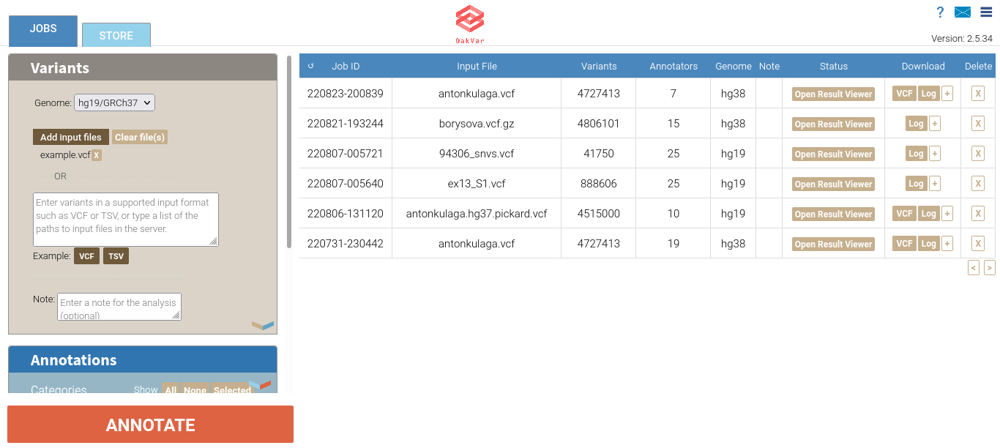
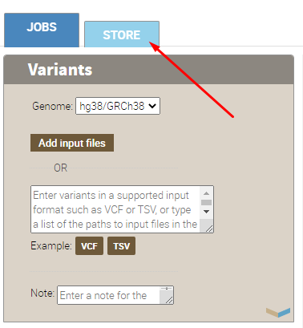
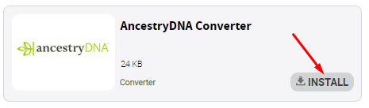
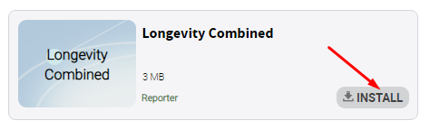
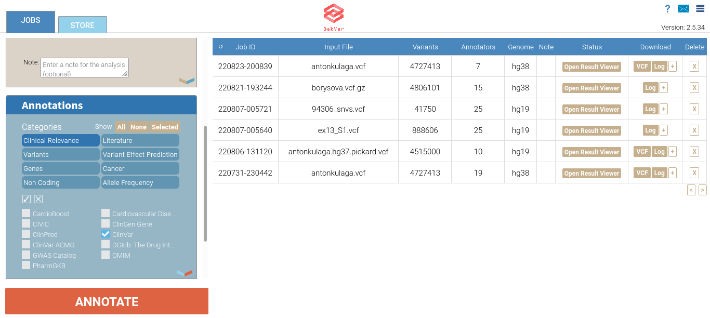
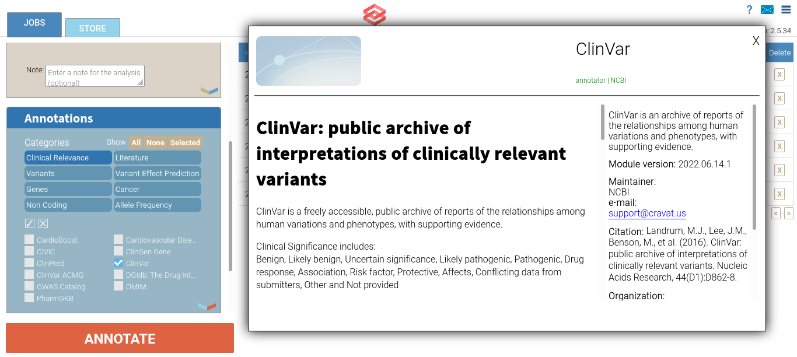
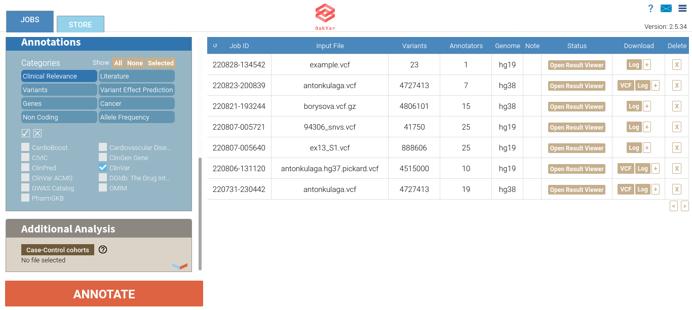
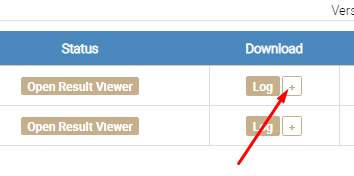
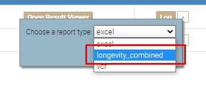
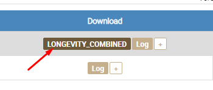

Getting Started
===============

**NOTE:** *Both OpenCravat and OakVar can be used to annotate a human genome. At the beginning of the project we used OpenCravat as a framework. However, as OakVar is based on OpenCravat and contains more advanced features customized specially for personal longevity genomics, we decided to base further development of the project on OakVar.*

Installing OakVar
----------------------------

Since our module is based on OakVar. You have to install OakVar first to run our module. 
OakVar docs: https://oakvar.readthedocs.io/en/latest/

Pre requirements for Oakvar: 
  - installed conda/mamba environment management systems, or you can use their lighter versions: miniconda/micromamba
  - installed python and pip

You can find documentation for mamba here: https://mamba.readthedocs.io/en/latest/index.html

And for conda here: https://docs.conda.io/en/latest/

*The installation of OakVar and further work must proceed after activation of an environment created by Conda/Mamba or Miniconda/Micromamba.*

Loading Genome Files
---------------------

1. After the installation of OakVar is finished you can activate Oakvar GUI using the following command:

``ov gui``
  
2. After the execution OakVar will be opened in your browser.
  
3. In the **Variants** section you should choose the right assembly version of the **Genome:** hg38/GRCh38, hg19/GRCh37, or hg18/GRCh36.

**Note:** A genome assembly is a computational representation of a genome sequence. Here you are choosing an assembly version of human genome which is a reference one to your genome.

For example we'll take a small VCF file of the hg19/GRCh37 version named example.vcf.

4. Click **Add input files**. A file upload dialog will open, allowing to browse and select the vcf file (or multiple files at once).

After loading the file(s) it will show next to the **Add input files** button along with another button **Clear file(s)** and a small **X** button next to each file name. If you click that **X**, the appropriate file will be deleted. If you click **Clear file(s)**, all the files you loaded will be deleted.

LongevityMap annotator
---------------------------------------------

Annotators are software modules which can be developed, added and installed as needed. They identify the locations of genes and all of the coding regions in a genome and determining what those genes do.

Longevity module includes **Logevitymap** annotator. 

LongevityMap is based on Pedro database: https://genomics.senescence.info/longevity/

It contains research and publications related to longevity and ranges them by significance. It aggregate all research by rsid to feet annotator output format. Furthermore, it depends on dbsnp module and is the source of data for longevitymap reporter.

For Longevity module to work you need to install the following annotators:

1.	ClinVar (clinvar)

2.	dbSNP (dbsnp)

3.	gnomAD3 (gnomad)

4.	NCBI Gene (ncbigene)

5.	OMIM (omim)

6.	PubMed (pubmed)

7.	LongevityMap (longevitymap)

You can install them by using terminal or Oakvar GUI

**Installation using terminal:**

Use the following command:

``ov module install module_name``

**Installation using GUI:**

To activate Oakvar GUI use the following command:

``ov gui``

After the execution GUI will be opened in your browser.

Go to “Store”:

Find annotators and install them:

Longevity Combined reporter
--------------------

Reporter is sofware that generates the visual results of your annotated genome. **Longevity Combined reporter** display your genome analysis related to longevity and disease risks.

It consist of 3 parts:

1. LongevityMap report, show your longevity-related rsid and their influence.

2. Cancer report, show cancer risks.

3. Drug report, show how your genome influences drug effects.

To install Longevity reporter you can use terminal or OakVar GUI:

**Installation using terminal:**

Use the followin command in terminal:

``ov module install longevity-combinedreporter``

**Installation using GUI:**

To activate Oakvar GUI use the following command:

``ov gui``

Go to “Store”:

Find the reporter called “longevity-combinedreporter” and install it:

Annotating Your Genome  
----------------------

Once an annotator is installed, you can select in on the **JOBS** tab in the upper left corner.

For example, let's select the **ClinVar** annotator from the **Clinical Relevance** category:

  
**Note:** An annotator may belong to multiple categories at once.

The checkbox and **X** buttons between the categories and the annotators sections allow to select all of the displayed annotator chechboxes or to clear all of them.

If you right-click any annotator, a pop-up window with its description will open in the right area:

  
For our purposes we will need the following annotators: **ClinVar** (clinvar), **dbSNP** (dbsnp), **gnomAD3** (gnomad), **LongevityMap** (longevitymap), **NCBI Gene** (ncbigene), **OMIM** (omim), and **PubMed** (pubmed). If any of them are missing, install them on the **STORE** tab, then go back to **JOBS**, in the **Annotations** section  select **All** categories, and then select each of the annotator checkboxes.  
  
When you select all the annotators you need, click the large **ANNOTATE** button below in the left area.

Annotating a large genome file may take some time. While loading, it will appear in the right area on the top of the list, displaying different stages of the processing in the **Status** column, and when finished, the **Open Results Viewer** button will appear in that column of the particular genome row:

Getting results
----------------------------

To get your Longevity Report, first, click on "+" in "Download" column:

  
Then choose a report type "longevity_combined":

and then click on "Generate" button and wait for report to be generated. After the process is finished, you can download the report by clicking on new appeared "LONGEVITY_COMBINED" button: 

In next sections of this documentation you can read detailed information about LongevityMap annotator, Longevity Reporter and how to work with filters of OakVar.
