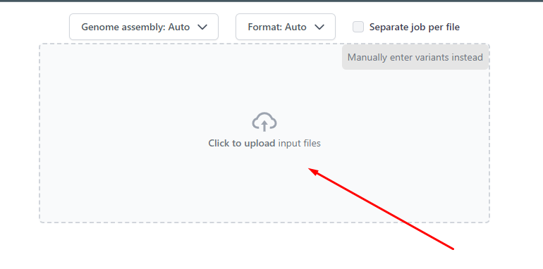
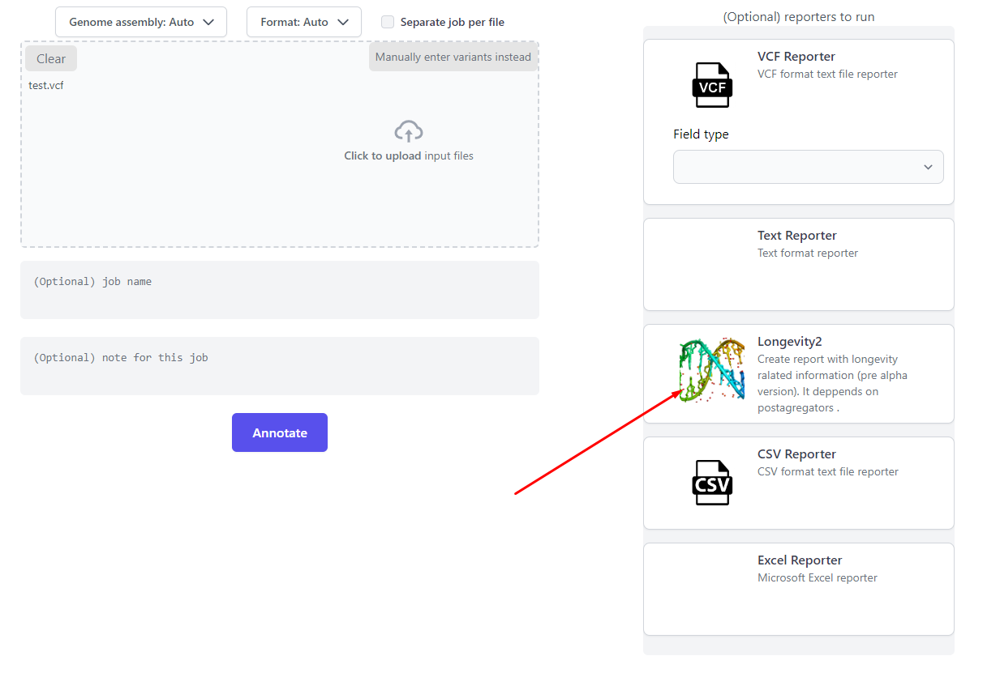
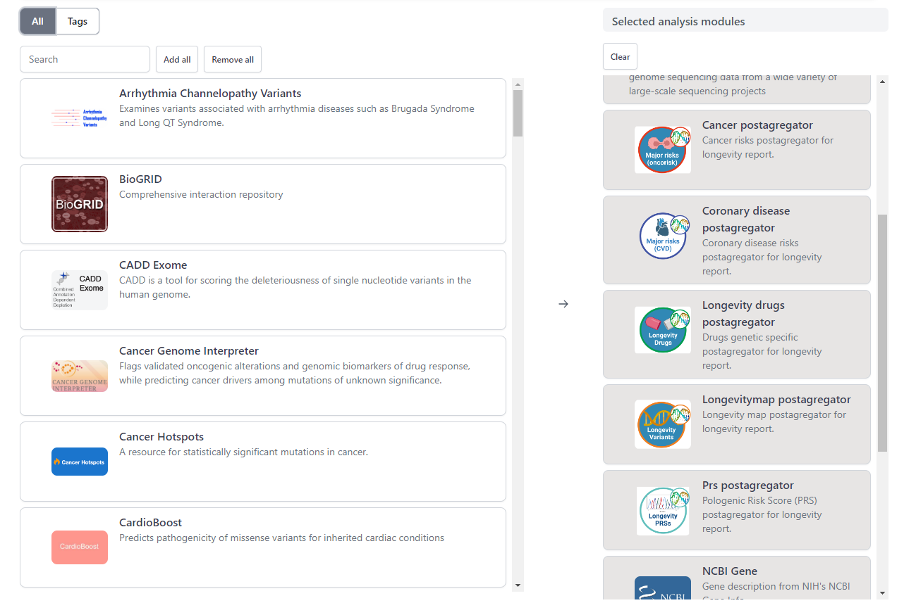
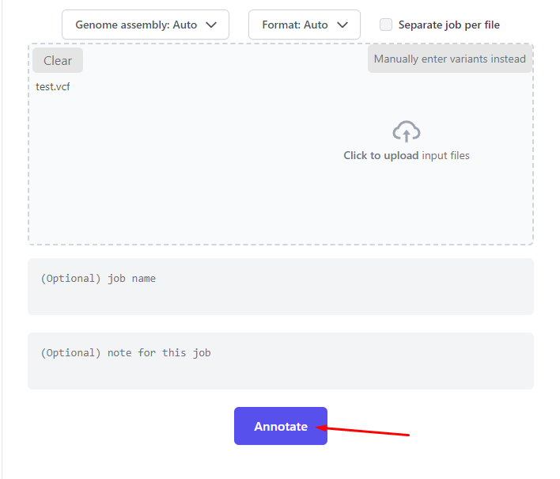
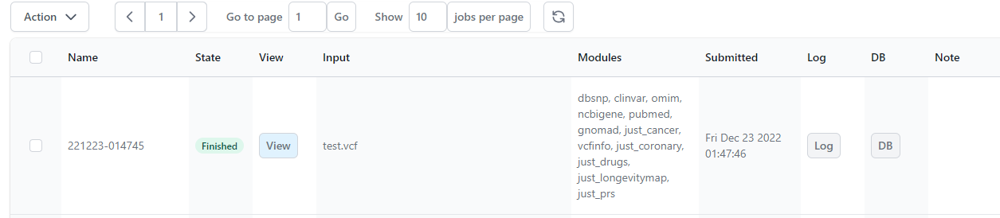
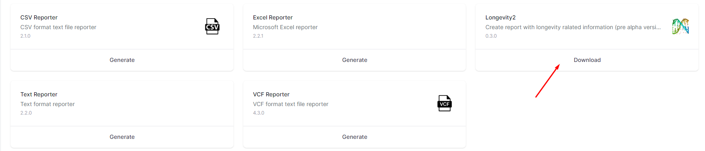

Getting Started
===============

**NOTE:** *Both OpenCravat and OakVar can be used to annotate a human genome. At the beginning of the project, we used OpenCravat as a framework. However, as OakVar is based on OpenCravat and contains more advanced features customized specially for personal longevity genomics, we decided to base further development of the project on OakVar.*

First, you need to open http://agingkills.eu:8081/index.html

Loading Genome Files
---------------------

In the "Submit" section click on "Click to upload input files" to upload your genome file.

Then choose Longevity2 in the reporters window:

All the necessary modules will be automatically selected. If you are interested in the other modules you can select them in the modules section:

Annotating Your Genome  
----------------------
  
When you select all the annotators you need, click the **ANNOTATE** button below in the left area.

Annotating a large genome file may take some time. While loading, it will be displayed in the "jobs" section, displaying different stages of the processing in the **State** column, and when finished, the **View** button will appear:

  
Opening Your Annotated Genome
----------------------------
  
Now click the **View** button, and the annotated genome will open in a new browser tab/window.

  
Getting Longevity2 report
----------------------------

In the new window open the "Reports" section and click the "Download" button in the Longevity2 reporter to download the longevity report:

