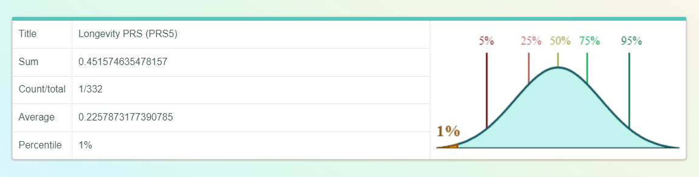
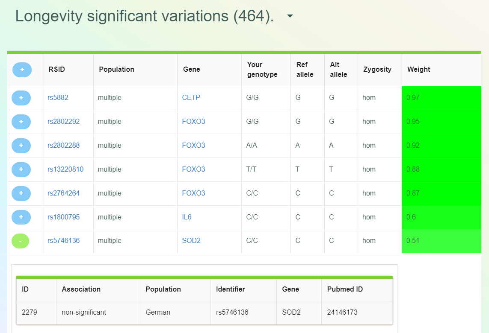
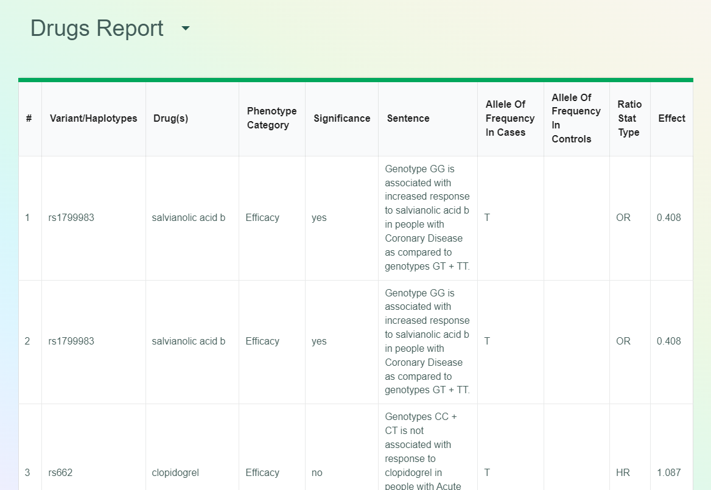
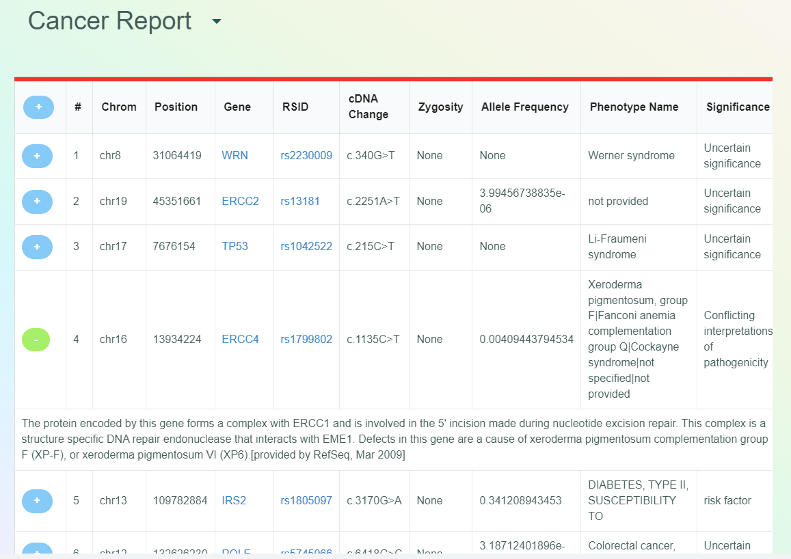
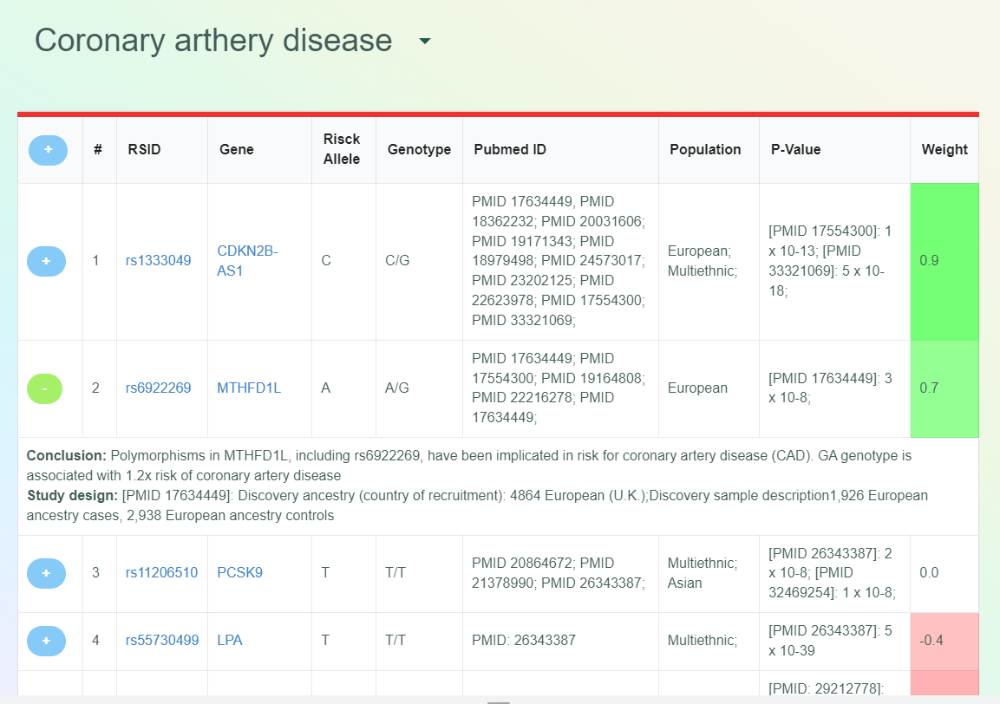

Viewing Reports
===============

Just-DNA-Seq makes a set of reports on a genome which contain data about PRS, longevity-related gene variants, known cancer risks, coronary arthery disease risks and drug responses.

You can learn how to get your longevity report and install Longevity Combined reporter in :doc:`getting_started`.

Source code on GitHub (here you also can learn how to install it from GitHub): https://github.com/dna-seq/oakvar-longevity

Part 1: Polygenic risk scores (PRSs) for gaining longevity
----------------------------------------

PRS is represented as a percentile within a given population. For example, you have the 95th percentile, which means your genetic chances to gain extreme longevity is higher than 95 out of every 100 people in a chosen population.

It does not take into account environmental factors and based on genetics only.

Part 2: Longevity Significant Variations
----------------------------------------

This report contains gene variants which have significant influence on longevity. It contains the following columns:

**+** - clicking this green button opens detailed information on each entry (row), and the button becomes red with **-** sign. Clicking this **-** closed the details.
Clicking **+** in the header opens the details for all rows and behaves in the same way (clicking **-** in the header closes all detail sections).

**RSID** - reference sequence ID of the variant.

**Population** - population(s) on which the research was conducted, e.g. Greek, Ashkenazi Jewish etc., or multiple (for more details, open **+**).

**Gene** - gene the variant belongs to.

**Your Genotype** - which variants your genome contains. Note that in case of homozygosity two letters should be the same, and for heterozygosity they differ.

**Ref allele** - reference allele.

**Alt allele** - alternative allele.

**Zygosity** - hom (homozygosity) or het (heterozygosity).

**Weight** - weight of this variant (the degree of significance).

Part 3: Drugs Report
--------------------

This report contains known issues of response to certain drugs associated with gene variants. It has the following columns:

**#** - number of an entry (row).

**Variant/Haplotypes** - by rsID.

**Drug(s)** - name(s) of drug(s) response to which is affected by the variants.

**Phenotype Category**: Efficacy, Dosage, or Other.

**Significance** - yes or no.

**Sentence** - description of the case.

**Allele Of Frequency In Cases** - allele of the variant (one or more letters A, T, C or G) in cases involved.

**Allele Of Frequency In Controls** - allele of the variant in controls.

**Ratio Stat Type**

**Effect**

Note: In some browsers the last one or two columns may be found beyond the visible area at 100% zoom level; in such cases try zooming out to 90%, 80% and so on until everything is visible.

Part 4: Cancer Report
---------------------

This report shows variants with known cancer risks and contains the following columns:

**+** - acting the same way in all reports (see above).

**#** - number of an entry (row).

**Chrom** - chromosome the variant belongs to, e.g. **chr1**.

**Position** - position of the variant on the chromosome (number).

**Gene** - gene the variant belongs to, like in the previous report.

**RSID** - reference sequence ID of the variant.

**cDNA Change** - change in the coding DNA by the variant.

**Zygosity** - hom or het (see above).

**Allele Frequency** - frequency of the allele.

**Phenotype Name** - description of condition(s) associated with the variant.

**Significance** - description of significance of this variant.

Part 5: Coronary arthery disease Report
--------------------

The report shows  variants with known coronary arthery disease risks and contains the following columns:

**+** - acting the same way in all reports (see above).

**#** - number of an entry (row).

**RSID** - reference sequence ID of the variant.

**Gene** - gene the variant belongs to, like in the previous report.

**Risk Allele** - 

**Genotype** - which variants your genome contains. Note that in case of homozygosity two letters should be the same, and for heterozygosity they differ.

**Pubmed ID** - the ID number to access corresponding articles on PubMed

**Population** - population(s) on which the research was conducted, e.g. Greek, Ashkenazi Jewish etc., or multiple (for more details, open **+**).

**P-Value** - 

**Weight** - weight of this variant (the degree of significance).

