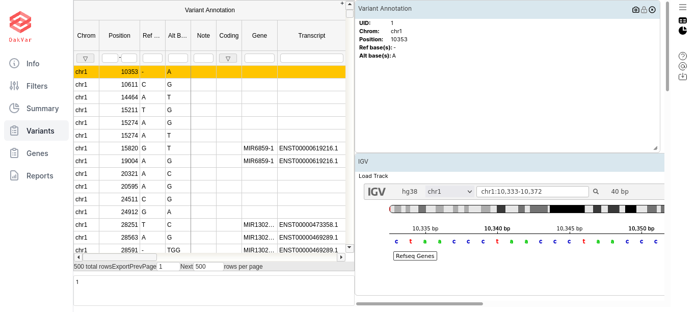
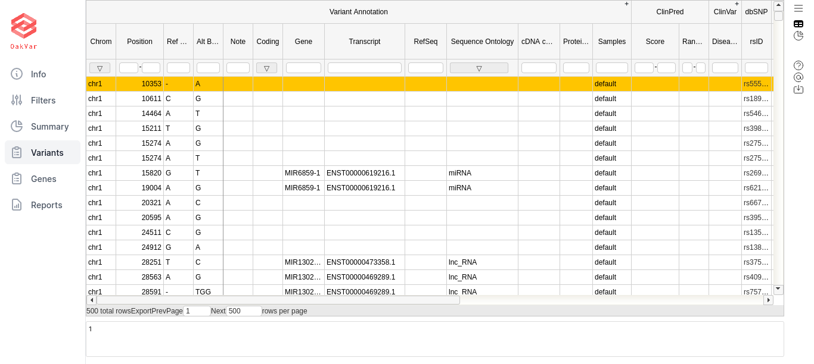

Working With Annotated Variants
===============================

After applying the necessary filters, select the **Variants** page.

By default a combined view is displayed, with both table and widgets:

  
By clicking the icons in the upper right corner, you can toggle on/off the table view (window-like icon) and the widgets view (piechart-like icon). For our purposes first of all we need the table view:

The table contains columns and column sets with general information about the filtered variants, as well as those connected to certain annotators. Some logically grouped column sets (by a particular annotator) can be extended or collapsed by clicking the **+/-** sign in the upper right corner of the column set (the topmost row). If you filtered by particular annotators, especially using "has data" condition, for other annotators it may show nothing for that particular variants, and they can be collapsed for convenience.

Each row of the table represents a variant that you can research.

The most important column groups for us are listed below, along with columns:

Variant Annotation
------------------

UID - the variant number in this (filtered) sequence

Chrom - chromosome where the variant is located. Chromosome names are ‘chr1’ to ‘chr22’, ‘chrX’, ‘chrY’ and ‘chrM’.

Position - chromosomal position of the variant. The first position in each chromosome is position 1.

Ref Base - reference allele at this chromosomal position (one of A, C, G, T, and N).

Alt Base - alternative allele; called based on reads mapping to this chromosomal position.

Note - note for the variant, if available.

Coding - whether this gene variant is coding.

Gene - the gene this variant belongs to.

Transcript - GENCODE transcript.

RefSeq - the reference sequence.

Sequence Ontology - could be: missense variant, start lost, stop gained, or stop lost. 

cDNA change - change of coding DNA.

Protein Change - change of protein being synthesized.

All Mappings - expression showing all the mappings.

Sample Count - the number of samples which contain the variant.

Samples - samples which contain the variant.

Tags - variant tags from the input file.

ClinVar
-------

Clinical Significance - the level of clinical significance of the variant.

Disease Ref Nums - disease reference numbers.

Disease Names - names of diseases associated with the variant.

Review Status - the level of review supporting clinical significance.

ClinVar ID - ID in the ClinVar database.

Significance Detail - additional detail on clinical significance used when it is conflicting.

dbSNP
-----

rsID - the database identifier ("rs" number) of this variant in dbSNP.

This column is empty if the observed variant is not described in dbSNP. Such
variants can be extremely rare variants or technical artifacts.

LongevityMap Annotator
----------------------

LongevityMap ID - ID(s) of the variant in LongevityMap.

Significance - could be: significant, non-significant, or conflicted.

Source Population - population the data were obtained on, e. g. Danish or American (Caucasian).

dbSNP id - ID of the variant in dbSNP.

Associated Genes - genes associated with the variant.

PubMed ID - ID of the variant in PubMed.

Info - additional information.

Description - detailed description of the research.

allele - allele associated with the variant.

state - state of the variant.

zygosity - zygosity of the variant vs OV.

weight - weight of the variant.

priority - priority of the variant.

VCF Info
--------

Phred - Phred quality score.

VCF Filter - if the VCF filter is passed (PASS).

Zygosity - most likely zygosity of the variant in this chromosomal position, computed from the
observed variant frequency (column 8). Can be “FP/HET” (<15%), “HET” (15-75%), “HET/HOM” (75-85%), or “HOM” (>85%).

Alternate reads - the number of reads showing the alternative allele.

Total reads - the total number of reads.

Variant AF - the variant allele frequency.

Haplotype block ID - ID of the haplotype block.

Haplotype strand ID - ID of the haplotype strand.
